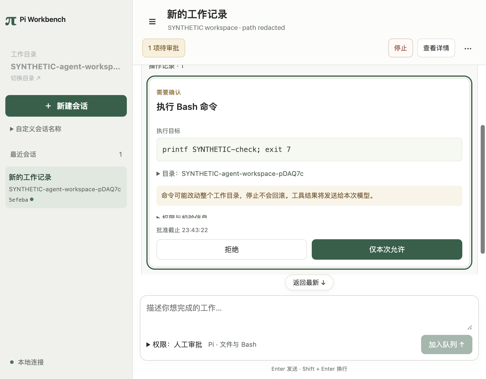

# 会话内审批与权限说明收口

开工基线 `ec075e71b471264489135b3a3545f7d36ec2c947`；仍在当前 `worktrees/develop` 工作树、`codex/ui-correctness` 功能分支。代码/测试先提交，再集中验证：主体 **`68e6596de6cb629e8a034237dec3150888473ceb`**，随后截图发现整卡裁切，修正为 **`e99c562856f3f99dc333911856ce62799992106d`**；具体命令对应SHA列于下表。未合入develop。

## 用户可见变化

审批直接出现在对应任务的操作记录中，按宿主Operation身份绑定，允许/拒绝后显示同一操作的结果；没有按位置猜测正文和工具的先后关系。当前pending来源是独立活动快照，历史内过时pending不会产生审批按钮。历史尚未加载、读取失败或当前Run不在已加载页时，会话底部显示同一待决操作；历史成功后只保留一张卡片。

顶部待审批按钮关闭可能遮挡会话的详情、定位并聚焦卡片，停止始终独立可达；慢历史查询不占用这两个入口。右栏只保留成果和预览，默认关闭、显式开合按会话保存，不再因新增审批/成果自动抢占正文。活动任务显示接收时固定的权限，输入区选择仍表示后续新任务权限。

模型系统提示与界面说明改为每个操作都要宿主授权，可由人工确认或既定自动规则决定，不再错误宣称全部人工。提示不是授权凭证，Worker没有新增权限参数；原目标/版本/期限/一次领取、取消与进程清理仍生效。拒绝/取消/未确认操作不得自动重试的提示保留。

## 参考、复用与边界

实施前复读pi-gui固定提交 `163054227d370a49d09099c61eb65798481294ac` 的timeline-item，借鉴按callId维护工具身份，本项目使用原Operation和ApprovalList；未移植其驱动或时间线模型。故障后读取同提交use-timeline-viewport，其“render不是scroll请求”、expectedScrollTop辨认自身事件的规则用于收敛原timeline-scroll；不引入估高/虚拟化或第二个滚动所有者。

Pi0.87.1发行包docs/sdk.md和现有ResourceLoader/getSystemPrompt类型确认原公开接缝，继续由explicitEmptyResources供给提示。React key/refs/布局effect经Context7核对。模块→参考→采用→保留边界见[指定参考](../ssot/reference-implementations.md)、[UI契约](../ssot/ui-experience-contract.md)和[权限契约](../ssot/permission-modes-contract.md)。无新增依赖、SQL迁移、IPC入口或全局配置变更。

## 实际测试与SHA

环境：macOS27.0.1 arm64、项目Node24.21.0、Pi0.87.1、Electron44.4.5/Chromium152.0.7977.130。所有Provider响应明确合成，实际工具/SQLite/子进程是真的；**真实模型调用0**。

| 命令 | 实际被测提交 | 结果 |
|---|---|---|
| `npm run typecheck` | e99c562（此前68e6596也通过） | exit0，严格类型/声明补丁 |
| `npm run test:desktop` | e99c562（此前68e6596也通过） | 40/40，原宿主/权限/查询/分页 |
| `npm run test:product-file-agent` | 68e6596 | 34/34，实际Pi文件工具、参数/权限/恢复回归 |
| `npm run test:product-model-shell` | 68e6596 | 39/39，人工与自动请求的真实Pi序列化提示均核对为宿主授权，原Bash/取消/后代/恢复/模式固定回归 |
| `npm run test:desktop-ui` | e99c562（此前68e6596也通过） | exit0，允许/拒绝/取消/崩溃、只读刷新/丢失确认、分页及新增会话内审批/布局检查 |
| `npm run test:desktop-agent-shell` | e99c562（此前68e6596也通过） | exit0，实际Pi Bash、人工/自动模式及重开不重发；新增审批Operation一致和整卡可见 |
| `npm run test:desktop-model` | e99c562（此前68e6596也通过） | exit0，合成正文/原Session继续/取消/安全错误 |
| `npm run test:desktop-shell` | e99c562（此前68e6596也通过） | exit0，无模型Bash允许/拒绝/取消 |
| `.venv/bin/python scripts/check-ssot.py` | e99c562 + 本报告等文档差异 | 60/60 |
| `.venv/bin/python scripts/test-tools.py` | 同上 | 15/15 |
| `.venv/bin/python scripts/check-docs.py --structural-only` | 同上 | 5通过、2跳过 |

e99c562只修改前端定位、审批可用高度和布局检查，未重跑没有变化的后端文件/Bash套件，不能把68e6596的后端输出称为e99c562实测。其余最终命令均实际在表中已存在提交执行，后续文档不回填不存在的SHA。

新增合成界面用例验证：首次历史失败仍有可聚焦的审批；历史恢复后同一Operation仅一张卡片，右栏不含审批；原36条历史/30版本下慢工具查询、三档窗口、草稿/焦点、阅读锚点、切会话、预览首中尾和迟到结果隔离。浏览/布局交互执行命令计数仍为0。真实鼠标拖宽和键盘/偏好重载用例沿用上一批。

布局检查现在要求整张审批卡片在timeline实际视口内，且允许按钮与停止命中可点击；完整展开详情也通过。请求窗口1320×860、1024×720、820×640；本次对应实际视口以截图JSON测量为准（1320档受当前Mac显示约束为1320×828），不将请求尺寸冒充截图尺寸。窄窗不依赖右栏承载审批。

## 开发失败与限制

1. 首次UI检查与诊断重跑均在进入历史阅读时超时，实际36条记录却回到末尾。旧hook按每个快照对象重新恢复位置，而轮询即使内容不变也产生新对象；改为会话载入/实际尺寸变化恢复，并参照上游过滤自身定位事件。原断言保留。
2. 中间一次运行在第30个成果预览断言中发现timeline位置变化；补具体位置诊断后的重跑未复现，最终代码集中检查也通过。未单独证明该次失败根因，保留记录，不宣称长期无抖动；历史其他UI等待问题也未由本批关闭。
3. 68e6596检查原按钮命中通过，但截图显示820宽展开审批标题部分裁切。修正为先提交阅读控件布局再定位，减少窄窗卡片最大高度，并新增整卡边界断言；e99c562回归通过，未削弱原按钮断言。

未测真实Provider、用户人工使用、VoiceOver完整流程、触摸/缩放、其他平台、生产发行；本批未重跑A0–A4全套/完整退出矩阵。完全访问、持久命名、Markdown/原生全文与真正正文/工具穿插仍未完成。UI-01/02及Gate不晋级；NEXT_STEPS唯一当前事项回到完全访问范围与平台接入。

原始日志 `.artifacts/inline-approval-20261003/`、截图 `.artifacts/ui-layout/` 留在忽略目录；以下最终截图仅遮去合成workspace的机器临时路径，其余控件/内容/布局未修改，新克隆可定位：

[1320宽截图](inline-approval-20261003/approval-1320.png)。

提交前检查diff与已知秘密模式、文件范围；没有用户配置/凭据/临时产品库、依赖目录或docs/startup入库。Skill评估：本轮是仍在演进的产品交互和故障修订，不新增大而泛的开发Skill；原集中测试脚本与Context7流程继续适用，无需修改项目Skill。
