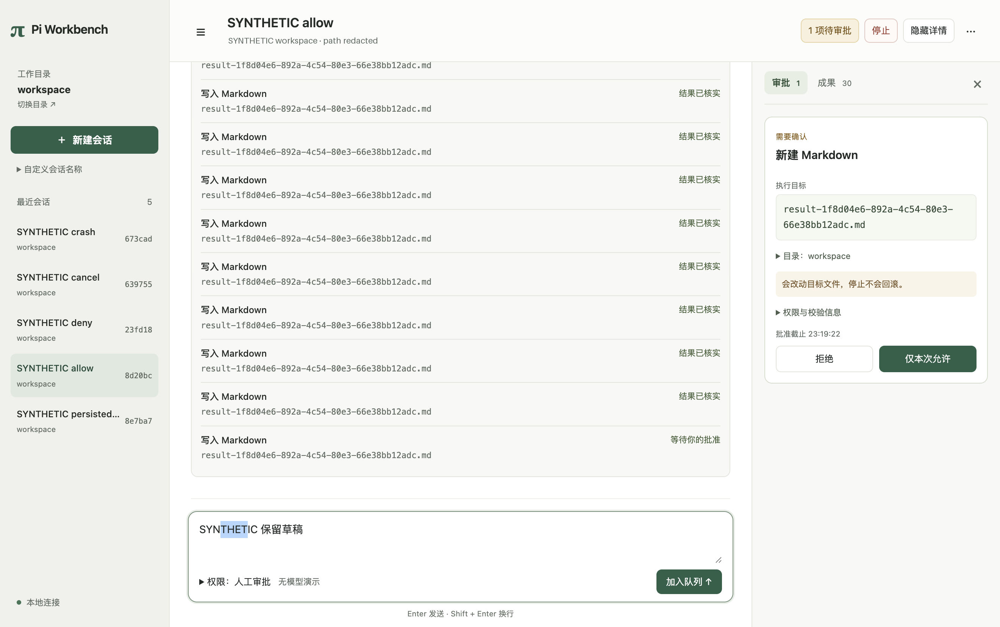

# 可拖动三栏与窄窗详情

开工基线 `fad0ac46bec5af72a9956dee6e2373eca4aa9195`；当前工作树继续使用 `worktrees/develop`，分支 `codex/ui-correctness`。实际被测代码 **`f742f982bde7f942826e1fe9a5f632a33364cd70`**，先提交代码和测试，再在该SHA集中验证，后续仅文档和脱敏截图。未合入develop。

## 本批新功能

导航和详情两条分隔线支持真实指针拖动、方向键20px微调、Home/End到边界、Enter或双击复位。导航可收起；左右栏宽度及导航开合保存在本机显示偏好，重载保留，损坏值回退。窗口缩小时限制实际显示宽度，放大后恢复偏好，不改变产品配置或权限。

窗口宽度小于1000px时详情覆盖正文；宽窗口仍为三块并排，正文至少360px。覆盖时正文暂不可操作，关闭按钮、Escape和背景点击可退出并返回详情入口；顶部停止、待审批和导航仍独立可达。关闭详情后恢复完整输入区域，原草稿不变。最小窗口沿用820×640。

复用固定pi-gui `163054227d370a49d09099c61eb65798481294ac` 的 `ui/pane-resize-handle.tsx`，实施前读取同提交源文件、workbench封装和根MIT。只依赖React，无新增包；归属与修改范围已补THIRD_PARTY_NOTICES.md。宽度/边界由本项目布局单一持有，移除上游组件内测量控制者并增加取消/失焦清理；查询、滚动位置、Pi Session和宿主审批均继续复用。参考映射见[UI契约](../ssot/ui-experience-contract.md)与[固定来源](../ssot/reference-implementations.md)。

**审批仍在详情页，不是最终行内审批已完成。** 下一批按Operation身份就近放置待决卡片，同时修正人工/自动模式说明；完全访问、持久命名、Markdown/原生全文安全阅读仍待推进。UI-01/02保持in_progress，既有Gate不扩大。

## 实际验证

macOS27.0.1 arm64；项目Node24.21.0、Electron44.4.5/Chromium152.0.7977.130、Pi0.87.1；使用既有依赖/锁/Python环境，未升级。所有Provider输入明确合成，真实模型调用0。

| 命令 | 结果与覆盖 |
|---|---|
| `npm run typecheck` | exit0，严格类型及原声明补丁 |
| `npm run test:desktop` | 40/40，原宿主/权限/查询/分页回归 |
| `npm run test:desktop-ui` | exit0，原真实宿主/Worker允许、拒绝、取消、崩溃及只读刷新/确认丢失回归；新增布局交互见下文 |
| `npm run test:desktop-agent-shell` | exit0，实际Pi Bash、人工/自动模式、重连/重载不重发，三窗口布局 |
| `npm run test:desktop-model` | exit0，合成流式正文、原生Session继续、活跃取消、安全错误 |
| `npm run test:desktop-shell` | exit0，原无模型Shell允许/拒绝/取消 |
| `.venv/bin/python scripts/check-ssot.py` | 60/60，采用/证据/计划及合成变异检查 |
| `.venv/bin/python scripts/test-tools.py` | 15/15 |
| `.venv/bin/python scripts/check-docs.py --structural-only` | 5通过、2跳过；不等于完整文档类型检查 |

布局测试通过Electron `sendInputEvent`发送实际鼠标按下/移动/释放与键盘事件，核对两栏各自变化48px、释放后移动不再调宽、Home/End边界、Enter复位。三档窗口请求尺寸1320×860、1024×720、820×640；实际截帧视口分别1320×828、1024×720、820×640，第一档受当前宿主窗口显示约束，未把请求尺寸冒充实测尺寸。全部无body横向溢出，审批与停止通过命中测试。

还覆盖：导航收起/展开、窄窗正文inert、Escape关闭及焦点返回；窗口缩小再放大恢复宽度；真实页面重载后恢复栏宽与导航开合；显式注入错误类型/超大偏好后回退默认。窗口失焦用明确合成的浏览器blur事件，拖动开始/结束仍是原生输入；不宣称真实操作系统焦点切换矩阵已经覆盖。保留36条合成历史/30个成果版本的草稿、阅读锚点、切会话恢复和迟到响应检查，全部布局/只读浏览交互向宿主提交执行命令计数为0。

开发中严格类型及初轮桌面检查通过，最终集中回归无失败。截图处理时仓库Python缺少Pillow，改用Codex已带图像依赖，未安装或改项目环境。没有运行A0–A4全套、完整退出矩阵、真实模型、其他平台、触摸手势或完整VoiceOver/缩放验收；既有历史UI等待超时没有被本批定位或关闭。

原始输出保留 `.artifacts/pane-layout-20261003/` 和 `.artifacts/ui-layout/`，不作为新克隆唯一证据；本报告与截图为持久摘要。截图来自上述最终运行，只遮去合成workspace的机器临时路径，控件、正文和布局未改：

[1024宽截图](pane-layout-20261003/panes-1024.png) · [820宽覆盖式详情](pane-layout-20261003/panes-820.png)。截图不是手工用户验收，也不证明未测权限能力。

提交前检查diff/变更文件，未纳入个人配置、凭据、产品库、依赖目录或docs/startup。SSOT采用入口、证据与NEXT_STEPS已同步，下一事项保持唯一。Skill评估：当前布局与审批安排仍演进，不把产品设计判断包装成通用Skill；既有集中回归脚本可复用，Context7流程仍适用，无需新增或修改Skill。
