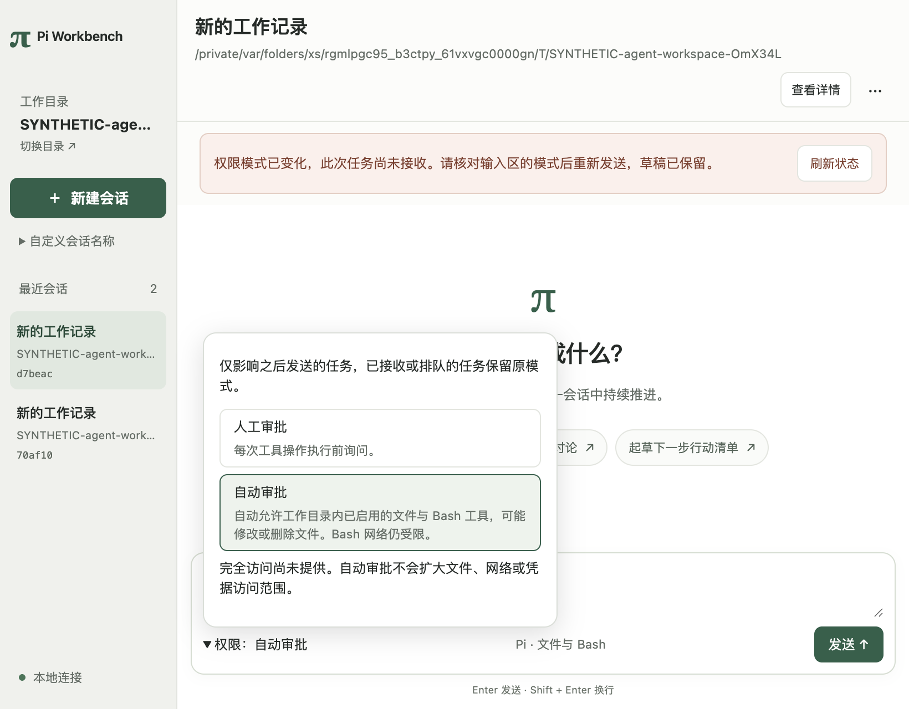

# 人工与自动审批：宿主到桌面的限定接入

日期2026-10-03；开工基线 `2234b76ccd2faf4bb0dbe2c535a7c94a2454b06b`，同一工作树与功能分支 `codex/ui-correctness`，未合入develop。实际被测代码 **`53cf8e63184484c5d2e8b30aff3e5630fd8c65fa`**；以下最终命令全部在该已存在提交执行，后续只有文档/脱敏截图。

环境：macOS 27.0.1 arm64，项目Node24.21.0，Electron44.4.5/Chromium152.0.7977.130，Pi0.87.1；Python使用原`.venv/bin/python`。无新增依赖、锁变更或全局配置修改；没有读取真实账户凭据或调用真实模型。

## 新功能与复用

输入区新增持久权限选择：人工审批沿用原逐操作流程；自动审批允许当前工作目录内已启用的文件/Bash工具，自动批准仍有持久记录与明确来源。Run接收时固定权限，之后切换会话模式只影响新任务；当前/已排队任务不变。旧库默认人工，旧CLI省略模式版本也仍为人工。

设置确认丢失时只重试同一请求；发送时模式版本过期则不创建Run、保留草稿供重新核对。窗口/宿主重开读取真实保存的模式和操作结果。自动执行不移除目标/资源/版本/期限校验、取消撤销、一次领取、操作结算或进程清理。

只新增产品模式/来源字段、SQL v10迁移、宿主固定规则和紧凑界面入口。Pi公开工具、原生Session、Supervisor/guardian、数据库所有权、平台限制及原缓存/分页继续复用。模块→参考/API→采用范围→保留边界见[权限契约](../ssot/permission-modes-contract.md)。没有重写Agent Loop、工具、Provider或Session树。

**完全访问尚未实现。** 当前自动审批不是风险分类器，不扩大目录、网络或凭据范围。三档方案中的第三档仍需独立平台接入与实际隔离证据，未伪造可选择按钮。

## 最终集中验证

| 实际命令 | 结果 | 范围 |
|---|---|---|
| `npm run typecheck` | exit0 | 严格产品类型、原声明补丁 |
| `npm run test:product-core` | 25/25 | 真实SQLite；权限版本/幂等、旧Run快照、未知工具、一次领取/过期/取消、v9→v10迁移；生命周期证据输入在单元测试中为合成 |
| `npm run test:product-sdk` | 5/5 | 原Pi接入回归 |
| `npm run test:product-worker` | 51/51 | 原真实子进程、来源绑定、隔离、故障/恢复及旧版本迁移 |
| `npm run test:product-file-agent` | 34/34 | Pi文件工具、资源/文件版本、审批和恢复回归；合成Provider |
| `npm run test:product-model-shell` | 39/39 | 自动write/read/Bash、运行中切换模式不追溯、真实取消/固定后代清理、自动批准后文件或资源改变阻止领取；原SDK/Shell故障回归，含真实31秒命令 |
| `npm run test:desktop` | 40/40 | 真实桌面宿主自动write一次、原请求重试/重开不重写、切回人工拒绝不落文件；原页面/缓存/宿主回归 |
| `npm run test:backend-history` | 15/15 | 后端分页/活动快照/工作区准入及历史查询边界 |
| `npm run test:desktop-agent-shell` | exit0 | 实际Electron输入区→IPC→宿主保存模式→两次真实Pi Bash自动执行→重连重载，自动来源可见；具体负向用例见下文 |
| `npm run test:desktop-ui` | exit0 | 原允许/拒绝/取消/宿主SIGKILL、长历史、成果版本、只读刷新、丢失确认及关闭失败回归 |
| `npm run test:desktop-model` | exit0 | 原合成流式正文、原生Session继续、活跃取消、安全错误 |
| `npm run test:desktop-shell` | exit0 | 原无模型Shell允许/拒绝/取消 |
| `.venv/bin/python scripts/check-ssot.py` | 60/60 | 采用、证据、任务引用与快照边界 |
| `.venv/bin/python scripts/test-tools.py` | 15/15 | 原仓库工具测试 |
| `.venv/bin/python scripts/check-docs.py --structural-only` | 5通过/2跳过 | 链接、原始快照、已知凭据文件/PEM标记；不是完整秘密扫描或文档类型检查 |

提交前`git diff --check`通过；检查变更文件范围，无用户配置、真实凭据、临时产品库、依赖目录或docs/startup内容入库。原始日志均留在忽略目录。

桌面新增的两类故障控制为明确合成，持久化和工具真实执行：

- 模式设置已经入库后丢弃确认，界面停止发送新任务、保留原请求重试；两次传输requestId相同，宿主只修订一次。
- 发送前由测试宿主将模式改为人工，带旧版本的Run被拒绝；产品库无新Run，界面保留完整草稿并显示新模式。用户重新选择自动后显式发送，才创建并执行一个Run。

自动工具新增用例的副作用真实核对：Markdown实际内容、Bash输出文件只含一次写入、工作目录外测试文件不存在、重开mtime不变。活跃取消读取真实测试子PID并核对其退出，后续文件未生成；只覆盖固定测试后代，不推导任意恶意进程隔离。自动批准后同步宿主订阅注入真实文件/资源变化，执行前校验阻止写入，操作撤销；不是把hostClean:true直接当进程证据。

开发中将新的投影字段改为生产必填类型时，类型检查指出五处合成fixture缺少字段；已补齐显式合成字段，未以可选/any/ts-ignore掩盖。最终集中回归无失败。本轮未复现或定位上一批UI帧等待的历史超时，不宣布其根因已解决。

原始日志和截图位于忽略目录`.artifacts/permissions-20261003/`；新克隆可定位本报告和下方持久脱敏截图。所有Provider输入、工具任务及故障资料均明确SYNTHETIC，真实模型调用0。程序化Electron检查不冒充人工使用验收；本轮未跑A0–A4全套、完整退出矩阵、Windows或生产安装发行。

## 界面证据与剩余事项

1320和820宽权限菜单按钮均在内容区内且未被遮挡，没有body横向溢出。截图保留版本冲突场景的明确提示；不把截图当作后端授权证据。

[1320宽截图](permission-modes-20261003/permission-picker-1320.png)。

SSOT补充权限模式契约、采用记录及本次证据。SEC-02、UI-01/02仍in_progress，M0 Gate不扩大。下一事项为完全访问的具体范围与平台实现，之后继续持久会话命名、Markdown/原生全文安全投影等既定整体计划；本批不是整个工作台目标完成。

Skill评估：这次权限产品设计尚在演进，依赖具体所有权判断，不新增笼统开发Skill。既有Context7查询和集中回归入口仍适用，没有需要同步修改的项目Skill。
