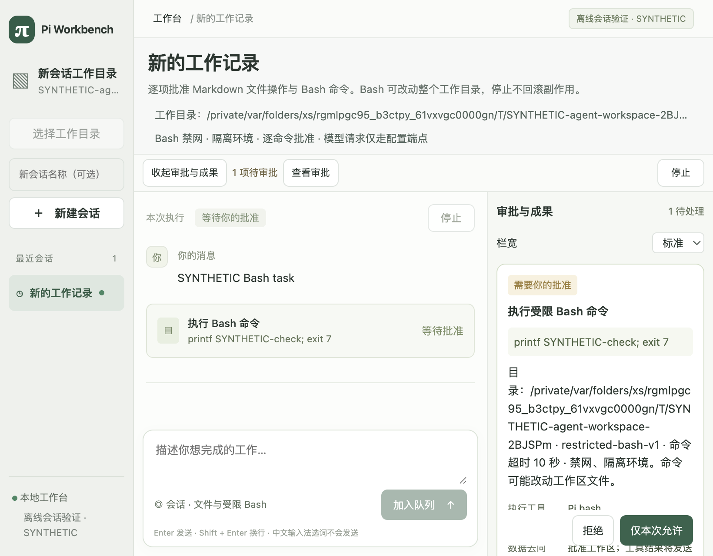
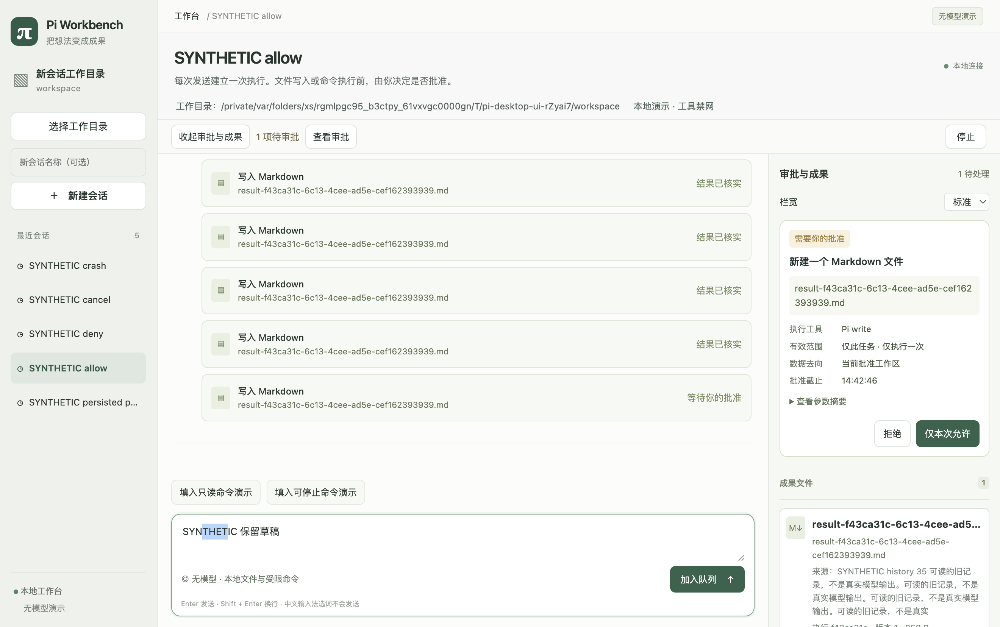

# 当前桌面 UI 审核与交叉质疑

日期：2026-10-03。代码基线：`d045ce45b64020a8fe0edf5a9e6ee4c52917d094`，当前工作树分支 `codex/model-error-diagnostics`。产品代码无本轮差异；新增内容是研究、审核和计划引用。外部参照见 [七个前端的布局研究](desktop-ui-research-2026-10-03.md)（六个产品加 pi-gui 专项补查）。不改 `docs/startup/`，不调用真实模型，不读取用户凭据。

后续实施：[UI重构报告](ui-refactor-2026-10-03.md)记录本审核之后的修订与剩余项；以下发现和“未修复”均保留首次审核时的状态。

## 总体结论

**三栏职责合理，已经能操作，但还不适合作为成熟日常工作界面的最终布局。** 最需要改进的是信息关系可信、恢复动作含义明确、阅读主次和成果定位；不是换个配色就够，也不是推倒重做整个前端。

建议沿用 pi-gui 作为单一主代码参考，借鉴紧凑标题、可辨识会话、正文中的工具摘要和按需旁栏；OpenCode 作交互对照。具体画面与组件在下一实施前定稿，根 MIT 许可已读，但组件依赖和迁移成本未全部审核。审批、停止、文件版本、未知结果和恢复仍以产品宿主为权威。不会为了复刻界面换 Harness、复制原生消息树或取消安全边界。

本报告有 **2 项 P1、9 项 P2、1 项 P3**；P1 是建议下一增量优先处理的体验/信息可信度问题，不代表发现权限突破。所有项尚未修复。代码可证风险与交互实测分别注明；不声称穷尽每种状态、平台和细节。

## 实际审核方法和覆盖

1. 主 agent 先阅读官方研究材料并形成研究报告，再启动一个普通 subagent `ui_critic`。没有指定特殊模型，也没有额外代理。
2. 双方分别阅读当前组件、样式、产品展示契约和本轮截图；主 agent 操作独立离线 profile，subagent 不控制应用。先交换独立意见，再进行两轮反驳/修订，裁定见下文。
3. 本轮真实 Electron 测试重新生成三种宽度截图；另用原生 UI 检查空状态、创建同名会话、审批过期/恢复、收起旁栏和 Tab 焦点。测试 Provider 明确合成，Pi/宿主/子进程是真的。
4. 用当前 CSS 颜色计算局部对比度。没有 VoiceOver 全流程、200% 缩放或色觉模拟，不作整体无障碍合规认证。

| 范围 | 本轮证据 | 结论边界 |
|---|---|---|
| 整体分区、标题、导航、输入 | 原生窗口/AX、当前源码 | 已看；空状态和两个默认同名会话已操作 |
| 820/1024/1320 宽布局 | 两套真实 Electron 检查及 PNG/metrics | 审批/停止可达且无横向 body 溢出；不等于文字密度满意 |
| 允许/拒绝/取消/崩溃/重连 | 现有 `test:desktop-ui` 重跑 | 合成流程，不是本轮真实模型验收 |
| Bash 审批、完整详情、工具结果 | `test:desktop-agent-shell` 重跑 | 两次真实 Bash 的合成 Provider 驱动；非零退出继续、重连不重放通过 |
| 手工审批过期恢复 | 两次短期限离线执行，随后“核验并恢复” | 都未完成手工允许；第一次尝试点击时 AX 元素已失效，刷新确认过期，未绕过；结果从待核实变未完成 |
| 成果长列表预览、非断线错误动作 | 源码/契约路径 | 本轮未手工诱发，登记为代码可证场景风险 |
| Markdown、正文截断、顺序 | 当前 JSX 与 adapter/contracts | 确认实现限制，不冒充新真实模型行为 |
| 未配置/缺凭据、真实 HTTP 错误、真实模型长输出 | 本轮未运行 | 仅核对代码；以前报告保留原 SHA 与范围 |

## 空间测量与视觉证据

所有数值为 CSS 像素；截图是 Retina 像素，不可直接当字号。原采集文件名 `1320x860` 的实际内容区为 **1320×828**，由本轮窗口环境约束，以下用 metrics 真值。

| 实际内容区 | 左栏宽 | 右栏宽 | 无模型演示时间线 | Agent Shell 离线时间线 | 审批/停止 |
|---|---:|---:|---|---|---|
| 1320×828 | 208 | 306 | 806×421.83 | 806×475.02 | 均可达 |
| 1024×720 | 180 | 264 | 580×319.83 | 580×345.83 | 均可达 |
| 820×640 | 154 | 260 | 406×220.63 | 406×273.83 | 均可达 |

820 宽 Agent Shell 的头部/说明/目录/工具栏占到 y≈221，时间线高度约占窗口 43%；无模型演示还有额外演示按钮，约占 34%，不能把后者外推为正式模式的比例。真实在线模式还可能显示模型配置区，未在本轮测量。

长工作目录在审批卡里反复折行，“目录”被拆开；可见内容与底部 sticky 按钮竞争，但按钮本身可点击。建议结构化显示目录、执行能力和风险，缩短默认摘要并允许明确查看完整值，不删除真实目标。

重复大工具卡占据主要阅读区，左栏长标题被截断，右栏在成果内容前还有栏宽和审批分区。此图说明密度和主次问题；不能凭此说工具重复执行，多个卡是测试构造的独立记录。

持久数值见 [布局测量](ui-review-20261003/metrics.json)。图片仅含合成任务和临时测试路径，未包含用户凭据或真实对话。

## 发现、改进和验收

### U01 · P1：正文与工具记录的排列不能表达真实先后

**代码确定**：`apps/desktop/run-history.tsx:25` 先渲染全部 assistant/tool 提示，`:27` 才渲染全部 Operation。因此最终回答也可能位于产生它的工具操作之前。当前区域又称“会话时间线”，用户容易误读因果。`packages/app-contracts/presentation.ts:3` 只有 id/role/text/truncated，没有足以把消息与产品 Operation 交错的关联。

最小修订：先明确标为“会话正文”“操作记录”，不假装已经按时序交错；若下一增量做真正时间线，应由宿主提供经过审核的顺序/关联投影。**不能按数组位置或 ID 字典序猜配对。** 验收覆盖多次工具、工具失败后继续、最终回答、历史分页和重连，且不复制 Pi Session。

### U02 · P1：普通请求失败也被引导去重启执行宿主

**代码确定、未手工诱发**：`renderer.tsx:47` 的非断线失败只提示请求未确认、审批可能过期；`:201` 对所有 problem 都给“重新连接”。`host-client.ts:92` 的 reconnect 先停止旧宿主，再连接新宿主，可能影响未完成任务。断线提示已经说明这一后果，不能指责所有重连都未告知；问题限于非断线通用错误路径。

最小修订：区分只读“刷新状态”、对原未确认意图的显式重试和会结束旧宿主的重连。不能自动重发有副作用命令。验收：审批过期/普通错误不会诱导无说明终止其他活动任务；真实断线仍有明确恢复和清理路径。

### U03 · P2：标题与说明重复，空侧栏占用默认空间

**截图+代码**：`renderer.tsx:17` 默认打开右栏；`:197`、`:198` 重复会话标题，`:198`、`:199`、`:222` 多处解释能力，`:204` 常驻工具条；右栏无审批/成果时仍显示两块空态和宽度选择。

建议把标题/目录/连接合为紧凑上下文，低频细节展开；按无审批/无选中成果的情境决定侧区显示。保留固定待审批计数、查看审批和停止，不强制每次审批抢焦点。下一稿同时给出空闲、活动、待审批、历史阅读四态；820 宽关键按钮可达、正文可读、草稿和阅读位置不丢。不能为多留一行正文删除具体操作风险。

### U04 · P2：默认会话难以区分

**本轮实测**：连续两次不填写可选名称，左栏出现两个“新的工作记录”。`renderer.tsx:193` 只显示标题和活动点；长标题省略，缺少可见目录/时间，界面无重命名入口。

先补可辨识默认名、辅助目录/时间和重命名；搜索/归档按实际规模分后续范围，不一次照搬所有项目管理。验收用同名、同前缀、不同目录、失败和活动会话，能不逐个打开就辨别；元信息不是授权范围的替代品。

### U05 · P2：点击成果后的预览可能出现在屏外

**代码可证场景风险，未手工复现长列表**：`artifact-panel.tsx:28` 渲染全部卡，`:42` 才放唯一预览；`:13` inspect 只改 state，不定位或转移焦点。较长列表点击靠前文件，加载、失败和预览都可能在下方，像没响应；标题又只有“纯文本预览”，缺文件/版本身份。

建议就近预览或独立内容区，显示选中文件、版本、核验时间并给可预期焦点。验收至少 30 条成果，首/中/尾项均能立即感知结果；切会话/重连时不呈现旧请求。不要滚动整个会话，更不能为便捷绕过宿主核验。

### U06 · P2：把登记版本数标成文件数

**代码确定**：`artifact-panel.tsx:26` 使用 artifacts.length 作为“成果文件”数量，每个版本各一张卡。对同一路径先写后改，用户可能理解为两个文件；小字说明不能替代整体对象模型。

先准确标示“文件/登记版本”，再考虑按路径收拢版本。保留来源 Run、版本、哈希核验以及不匹配时拒绝展示，不能把历史版本内容假装为当前文件。验收 write→edit→外部变化，路径和版本不会混淆。

### U07 · P2：正文缺少适合阅读的结构

**代码确定**：`run-history.tsx:25` 仅用 `
` 展示；Markdown 标题、列表、代码和链接都按文本输出。纯文本是当前安全选择，不是漏洞，但难以阅读代码/报告，也缺少消息或代码块复制入口。

建议先选择已审核的安全排版/Markdown 组件，限制链接协议、原始 HTML、远程图片和主动内容；文件链接仍经产品成果身份解析。验收普通中文、代码、长 URL、恶意 HTML/链接均不扩大访问权限。不先塞入完整编辑器或 diff 系统。

### U08 · P2：摘要截断后缺少完整安全补读

**已知能力缺口，不是本轮新回归**：`packages/pi-adapter/presentation.ts:21` 单条展示最多 2048 个字符串代码单元，整个投影还有 16 条/8000 总长度限制，契约重复校验。`run-history.tsx:25` 只提示截断，无完整安全正文入口。

这是**展示投影限制，不是 LLM token/请求/预算限制**。后续需要有界安全补读，不能仅放大 IPC 或透传原生 Session。先让“摘要”“未显示”明确可见，再规划协议补读。验收长回答可到达完整获准正文，旧历史可读，隐私过滤和背压保留。

### U09 · P2：工具详情与审批长字段需要分层

**代码+本轮截图**：`run-history.tsx:27` 的 Bash details 默认 open，每条都有 stdout/stderr；`approval-list.tsx:6` 把长目录、profile、超时、风险放在一个段落。820 宽审批细节很难扫读，但 sticky 操作按钮确实可达。

建议工具默认摘要，失败/非零退出/截断保持显眼，详细输出按需展开；审批用“命令、目录、影响、一次授权”清楚分行，机器参数摘要继续次级展开。确认目标/差异不藏进不可发现入口。图中的 10 秒是显式离线 fixture，不得变成产品默认 Bash 超时。

### U10 · P2：必要的小字对比度偏低

**静态 CSS sRGB 计算**：不是截图取色；不含动画/父级透明度合成。现有 `.model-run .run-label` 还有 opacity，实际显示需另测。

| 文本 | 前景 / 背景 | 比值 | 当前字号 |
|---|---|---:|---:|
| 输入法/换行提示 | #9aa297 / #ffffff | 2.629:1 | 9px |
| 消息角色标签 | #8d9784 / #fcfdfb | 2.986:1 | 11px（末尾 CSS 覆盖早期 10px） |
| 普通运行状态 | #697f5d / #edf1e9 | 3.829:1 | 11px |
| 暂无待处理审批 | #94a087 / #f6f8f4 | 2.573:1 | 11px |

[W3C 普通文字对比度基准](https://www.w3.org/WAI/WCAG22/Understanding/contrast-minimum.html)为 4.5:1；本表不包含禁用按钮或纯装饰。建议必要说明与状态满足这一基准，建立少量统一字号/颜色层次，不能只放大标题。验收最终计算样式、焦点和200%缩放；本次不声称全站 WCAG 评估完成。

### U11 · P2：审批焦点和动态通知尚不完整

**代码风险、未做完整辅助技术验证**：`renderer.tsx:46` 的“查看审批”只展开并滚动；审批成功后按钮从树中移除，下一焦点未明确管理。运行结束没有针对结论的独立 live 通知。现有 label、aria-current、role=status/alert、focus-visible 都应保留，不能说当前完全没有无障碍。

建议把焦点送到命名审批区域/下一合理控件，处理后给简短状态，不让整段 token 流反复播报。本轮只实测收起旁栏后 Tab 能到“执行记录”；VoiceOver、审批后焦点、跨窗口缩放仍待验证。

### U12 · P3：图标和术语与真实动作不完全一致

**设计判断**：成果图标 `M↓` 像下载，实际为核验预览；模型正文与工具失败提示同用 π 头像；多处“本次执行”“工具受配置限制”“restricted-bash-v1”偏实现语言。

建议统一图标、用“检查并预览”明确动作，工具/模型身份用文字区分。内部参数可放详情，不删除审计身份。颜色、圆角和品牌气质属于后续样式决定，不登记为功能错误。

## 两轮相互质疑及最终裁定

| 议题 | 初步主张 | 对方反驳 | 裁定 |
|---|---|---|---|
| 空侧栏 | 主 agent 倾向默认收起节省空间 | subagent：审批发现和固定停止是已验证优点，自动展开又可能抢阅读焦点 | 采用情境式方案；默认策略待四态设计核验，不简单全面隐藏 |
| Markdown/diff | 主 agent 强调正文和成果可读性 | subagent：先修信息可信度与恢复语义；完整diff/编辑器超出范围 | U01/U02优先，安全排版单独增量，不把美化和协议扩权捆绑 |
| 会话管理 | 主 agent 提到搜索/重命名/归档 | subagent：实证是同名难辨，先最小辨识和命名，不整套复制 | 接受缩减，搜索/归档按规模后置 |
| 重连 | subagent提出动作风险 | 主 agent：断线分支已说明，不应笼统称未告知 | 锁定非断线通用错误；保留原断线文案优点 |
| 成果预览屏外 | subagent提出布局风险 | 主 agent要求分清源码风险与实际点击复现 | 仍保留U05，但明确未手工长列表复现 |
| 工具时序 | 双方同意有问题，主 agent质疑是否只是排版P2 | subagent认为会改变用户对因果的理解，属P1；不是权限绕过 | 接受P1，过渡用明确分组，完整交错须产品关联 |
| 开源复刻 | 主 agent建议pi-gui主参考+OpenCode对照 | subagent：不能说整套已准入；OpenCode本轮没完成布局视觉核对 | 有条件采纳；后补固定pi-gui图与根许可仍不代表全部组件准入 |
| 局部测量 | 主 agent最初用无模型小窗高度代表拥挤 | subagent指出演示按钮和1320文件名高度差异 | 表格分别记录两模式实值；不泛化至正式在线配置态 |

双方没有采纳的说法：当前三栏整体失效、审批按钮被遮挡、所有重连毫无告知、纯文本本身不安全、一次必须复制全部竞品功能。保留的分歧不是遮掩问题，而是限定优先级和证据范围。

## 建议的后续实施顺序（尚未开工）

1. **信息与动作正确性**：U01/U02，连同精确措辞和最小回归；必要协议改动贯穿前后端，不只改 CSS。
2. **一个完整布局状态组**：以固定 pi-gui 为主参考，交付紧凑头部、可辨识导航、工具摘要、审批/成果分层、就近预览及对比度；覆盖 U03–U06/U09–U12。先给1320/1024/820四态方案，再集中实施和离线回归，避免边写小功能边调用模型。
3. **安全阅读能力**：U07/U08 单独审定展示组件和有界补读。保留原生历史权威、分页水位、查询缓存和单一滚动所有者；不把 Q2/Virtual/durable 当布局前置。

每组结束再集中验证：新建→发送→审批允许/拒绝→工具→成果→取消/失败→恢复→旧历史。UI 不得乐观冒充工具执行，不能自动重试副作用。此处是审核建议，未将新增方案标为已采用/已完成；下一当前事项仍由 NEXT_STEPS 顶部唯一指定。

## 本轮命令、结果与可复现性

平台：macOS 27.0.1（26A434）、arm64；项目 Node 24.21.0，Electron 44.4.5 / Chromium 152.0.7977.130。命令在仓库根执行，Node 使用项目既定工具链；不依赖用户全局 Pi。

| 命令/动作 | 结果 |
|---|---|
| `npm run test:desktop-ui` | 通过；allow/deny/cancel/crash、确认丢失重试及关闭失败回归；3宽度采集 |
| `npm run test:desktop-agent-shell` | 通过；合成Provider、真实受限Bash、2次独立审批、非零退出继续、重连不重放；折叠/展开详情各3宽度采集 |
| `npm run demo:agent-shell -- --dev-profile=ui-review-20261003` | 正常启动/退出；主agent通过原生UI完成上述限定交互检查，非用户人工验收；两次审批超时而非手工允许成功 |
| CSS 对比度 Python 计算 | 上表4组结果；只针对当前静态颜色，不是完整无障碍扫描 |
| `.venv/bin/python scripts/check-ssot.py` | 60/60通过 |
| `.venv/bin/python scripts/test-tools.py` | 15/15通过 |
| `.venv/bin/python scripts/check-docs.py --structural-only` | 5通过、0失败、2跳过；未运行文档示例typecheck |
| `git diff --check` | 通过 |

原始日志、研究获取材料、独立 subagent 初审和对比度数值存 `.artifacts/ui-review-20261003/`；全部必要结论、交叉质疑、脱敏图片及 metrics 已放本报告和相邻持久文件，新克隆不依赖本机忽略目录。未重跑完整 A1–A4/所有产品后端/真实模型回归，因为产品代码未改；两套桌面测试是为得到当前布局证据，不把历史测试计为本轮。

SSOT 只登记审核完成与问题范围，UI-01/UI-02/ART-01 状态保持 in_progress，Gate 不晋级。Skill评估：此工作依赖人工判断，暂不创建总括性审核 Skill；现有布局采集和文档检查足够复用。OpenAI Docs 技能完成官方资料查阅，流程没有被本轮发现需要更正的步骤。
