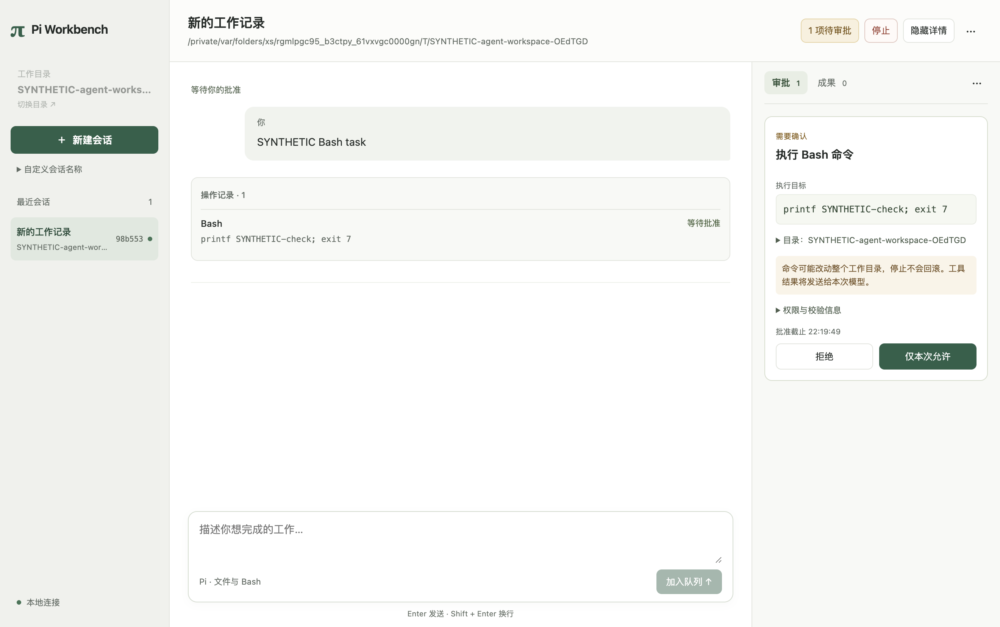
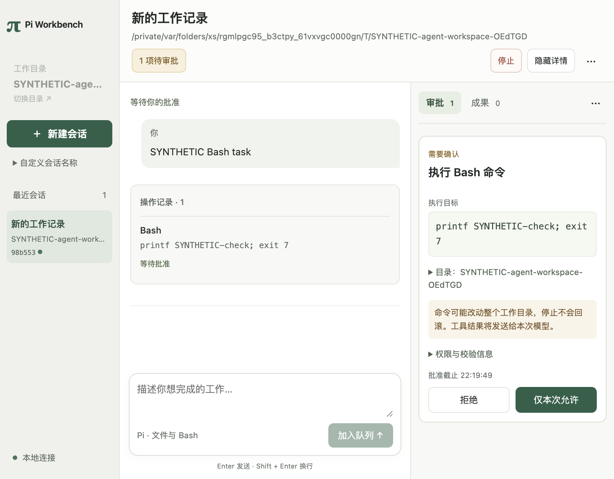

# 会话工作台整体重构：限定交付与验证

日期：2026-10-03。集成基线 `d045ce45b64020a8fe0edf5a9e6ee4c52917d094`；开工 HEAD 为只追加审核文档的 `1f15875d709db8a12d506a34012fce0db217ca2a`。fetch 后 origin/develop 未前进。当前会话仍使用原 develop 工作树目录，新分支 `codex/ui-correctness`；其他工作树及其未提交内容未改动。

代码增量：

- `f2787e0cf61acf484786400d9e31090cb3e9cbc9`：正文/操作明确分区，普通失败只读刷新，断线重连、未确认意图重试保持独立。
- **`5468a3df96f1c6ae343b77e69c219630ba6320b2`**：按用户“大刀阔斧、直接重构”的要求整体改版。下表最终集中回归均在该已存在提交运行，后续只有本报告与 SSOT 文档差异。

环境：macOS 27.0.1（26A434）arm64，项目 Node 24.21.0 arm64，Electron 44.4.5 / Chromium 152.0.7977.130，React 19.3.0，Pi 0.87.1。不改版本、锁、初始化、全局配置或用户凭据；不调用真实模型。Provider、显示历史和故障输入明确为 SYNTHETIC，实际 Electron、产品库、Pi 工具和 Worker 进程按各测试说明运行。

## 本轮带来的功能与界面变化

导航收敛为目录、创建会话与会话列表，可选名称收进展开项；同名会话可借助目录和短身份区分。顶部只保留当前会话/目录及即时动作，删除重复标题和大段常驻说明。空会话默认使用完整正文空间。

右侧拆成审批/成果两页，按需要展示，手动收起和选择按会话保留。常驻待审批入口和停止不依赖历史页；运行中只保留顶部停止，排队项可单独取消。审批默认只显示具体目标、影响、期限及允许/拒绝；完整目录、执行配置和参数摘要可展开，固定按钮不随长内容离开卡片。

正文和操作记录清楚分组，工具输出与用量信息默认折叠；没有声称已实现真正交错时间线。成果以登记版本计数，预览紧邻所选条目并带文件/版本身份，打开后聚焦，关闭回到原条目；连接变化废弃旧预览。普通错误只读刷新，慢刷新不阻塞停止，不会结束 Worker 或自动重发操作。

整份 CSS 从 880 行（含首批分区样式）重整为 225 行，替换叠加覆盖，不叠第二套组件框架。这是维护结构变化，不以行数证明体验质量。没有新增依赖或公开后端命令。

## 复用与权限模式

模块到固定参考/API及边界见 [UI契约](../ssot/ui-experience-contract.md)。继续复用 pi-gui 的既定布局方向、已移植键盘保护、React 公开 hooks、现有 ThreadPages/Query 和单一滚动 hook；Pi Session/工具/宿主审批链路不重写。

用户提出的人工审批／自动审批／完全访问，已核对 Codex、Claude Code、OpenCode 官方资料并写入下一接入设计。各产品不是三个完全等价模式；自动审批和 OS 访问范围必须分开。**本次仍只有实际已实现的逐项审批，不把隐藏提示当作自动授权，也未新增完全访问开关。**

## 实际命令与结果

最终代码 `5468a3df96f1c6ae343b77e69c219630ba6320b2`：

| 命令 | 结果与实际范围 |
|---|---|
| `npm run typecheck` | exit 0，严格类型与既有声明补丁检查 |
| `npm run test:desktop` | 39/39；真实宿主/SQLite/Worker及合成查询状态，含原查询/分页回归 |
| `npm run test:desktop-ui` | exit 0；真实允许/拒绝/活跃取消/宿主崩溃重开，确认丢失同意图重试；具体UI行为断言见下文 |
| `npm run test:desktop-agent-shell` | exit 0；合成Provider驱动两次真实Bash，非零退出后继续；工具折叠/手动展开保持，宿主重连+窗口重载后正文顺序/两条操作及文件mtime不变 |
| `npm run test:desktop-model` | exit 0；合成流式正文、原生Session继续、活跃取消、安全错误展示 |
| `npm run test:desktop-shell` | exit 0；原无模型Bash允许/拒绝/取消三场景 |

UI 新增及保留的关键断言：

- 普通审批请求合成失败后只显示“刷新状态”；读取期间停止可用，读取后宿主PID、原Operation与pending状态保留，目标文件仍不存在。
- 已持久接收请求的确认被合成丢弃：刷新不新增command、草稿保留；显式重试复用原requestId，仍只有一个Run。原跨Thread/断线重试回归保留。
- 正文与操作各自分区；多Bash操作、失败继续、最终投影和重开保持正文数组顺序，未按ID猜配对。
- 合成36条显示历史、真实60条持久历史与61条续发/重连场景；前插锚点、返回最新、草稿/输入焦点、慢历史不阻塞审批/停止、Q1错误手动重试仍通过。
- 30条合成果版本，首/中/尾预览位于对应条目旁、具有正确版本和焦点；关闭回到原条目，正文滚动位置不变；ready/changed/missing/unavailable与迟到跨Thread预览回归通过。
- 三尺寸、三档栏宽、手动收起后新审批不抢焦点；无横向body溢出，审批与停止可点击，输入框在窗口内。

首次开发类型检查因测试变量PID推导报TS7022，显式标注`number | undefined`后通过。整套重构第一次UI运行在`ui-p2-approval:1320:frame`等待帧时超时；未改超时或削弱断言，后续重跑及最终提交集中回归通过。该次帧等待原因未定位，不把重跑通过当根因解决，也不关闭历史另一工作树的UI超时。

开工和文档收口使用项目Python环境运行 `check-ssot.py`、`test-tools.py`、`check-docs.py --structural-only`，分别60/60、15/15、5通过/2跳过；结构检查不冒充完整文档类型检查。`git diff --check`及提交文件/已知凭据文件与PEM标记检查通过。未重跑A0–A4全套、生产构建安装、真实账户模型或其他平台测试，不沿用旧结果为本轮实测。

原始输出保留 `.artifacts/ui-correctness-20261003/`（首批基线同时位于 `.artifacts/ui-review-20261003/baseline-*.log`），本报告和下方脱敏截图/数值可在新克隆定位。

## 视觉与尺寸

同一待审批Agent Shell场景，比较前次基线d045ce4与本次最终代码；像素按实际窗口内容区，不按图片文件名推断。

| 内容区 | 原正文高度 | 当前正文高度 | 审批/停止 |
|---|---:|---:|---|
| 1320×828 | 475.02 | 593.06 | 可操作 |
| 1024×720 | 345.83 | 493.06 | 可操作 |
| 820×640 | 273.83 | 388.62 | 可操作 |

[机器可读测量](ui-refactor-20261003/metrics.json)。截图仅含合成资料和临时测试路径，无真实账户/密钥：

[会话与成果列表截图](ui-refactor-20261003/conversation-artifact.png)。成果就近预览由上述程序化断言验证，此截图未展开预览。截图及程序化断言不是用户人工验收、VoiceOver认证或全部状态视觉覆盖。

## 审核项与剩余工作

U01完成最小分区方案，真正交错仍未实现；U02已修正恢复动作；U03整体布局、U05就近预览、U06版本计数已实施；U09默认展开/信息冗余已收敛。U04只补目录/短身份，持久重命名未实现；U07 Markdown、U08全文补载未实现；U10/U11/U12重整局部配色、焦点及装饰性信息，尚无完整无障碍/图标系统验收，不能全部标done。

UI-01/02、ART-01保持in_progress，既有Gate不扩大。下一项先定义权限三档的实际策略与接入，再补会话命名及安全阅读。Skill评估：现有集中验证流程和Context7/OpenAI Docs用法仍适用；本次涉及持续设计判断，不提炼为新的本地操作Skill。
